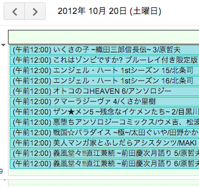
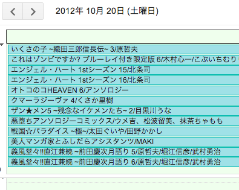

PerlでiCalendarを出力してみた
====

こばやし けんいち

自己紹介
----

* こばやし けんいち
* Twitter: @Niratama
* 携帯サイトやソーシャルゲームでごはん食べてます

iCalendarとは
----

* [RFC 5545](http://tools.ietf.org/html/rfc5545)で規定された、スケジュールの標準フォーマット
 * [iCalendarデータの例](http://ja.wikipedia.org/wiki/ICalendar#.E3.82.B3.E3.82.A2.E3.83.BB.E3.82.AA.E3.83.96.E3.82.B8.E3.82.A7.E3.82.AF.E3.83.88)
* Googleカレンダーにインポートするときに使える←今回の目的

今回の目的
----

* [コミック新刊ラインアップ](http://www.sm.rim.or.jp/~suzuki/comics/)のデータをGoogleカレンダーに載せたい
 * 人間が読むことが前提のテキストファイル
 * １ヶ月分のデータが３つのファイルに分割されている
 * 文字コードはEUC(ただしCP51932)

iCalendar関係のモジュール
----

* [Data::ICal](https://metacpan.org/module/Data::ICal)
 * 今回使ってみました
* [Net::ICal](https://metacpan.org/module/Net::ICal)
 * 最終更新が古かったので保留
* [Tie::iCal](https://metacpan.org/release/Tie-iCal)
 * 読み込みのみ
* [iCal::Parser](https://metacpan.org/release/iCal-Parser)
 * 読み込みのみ

Data::ICalの使用例
----

	use Data::ICal;
	use Data::ICal::Entry::Event;
	my $cal = Data::ICal->new;
	my $ev = Data::ICal::Entry::Event->new;
	$ev->add_properties(
	  summary => 'Chiba.pm #1',
	  dtstart => '20121020',
	  dtend => '20121021',
	  description => 'at funabashi, chiba',
	);
	$cal->add_entry($ev);
	print $cal->as_string;

iCalendarの出力例
----
	BEGIN:VCALENDAR
	PRODID:Data::ICal 0.18
	VERSION:2.0
	BEGIN:VEVENT
	DESCRIPTION:at funabashi\, chiba
	DTEND:20121021
	DTSTART:20121020
	SUMMARY:Chiba.pm #1
	END:VEVENT
	END:VCALENDAR

日付の扱い(1)
----

* 日付の計算があるのでそれ用のモジュールが使いたかった
* [Date::ICal](https://metacpan.org/release/Date-ICal)
 * 独自実装
* [Data::ICal::DateTime](https://metacpan.org/release/Data-ICal-DateTime)
 * Data::ICalにメソッドを生やす形
 * DateTimeを使う

日付の扱い(2)
----

* 全日イベントとしてGoogleカレンダーに登録したかった
* DTSTARTやDTENDに時刻が入っていると、全日イベント扱いにはなるものの、イベントに時刻が表示されてしまう。
* Date::ICalもData::ICal::DateTimeも「日時」でしか出力できなかった。

日付の扱い(3)
----

* 結局、Time::Piece->strftimeで[DATE型](http://tools.ietf.org/html/rfc5545#section-3.3.4)を直接文字列として出力するようにした。

できたもの
----

こちらになります

まとめ
----

* Data::ICalはわりと素直
* iCalendarの仕様に軽く目を通しておいたほうが使いやすい
 * プロパティの名前がiCalendarそのままなので
* DATE-TIME型でなくてDATE型を扱う場合は今のところ適切なモジュールはなさそう

